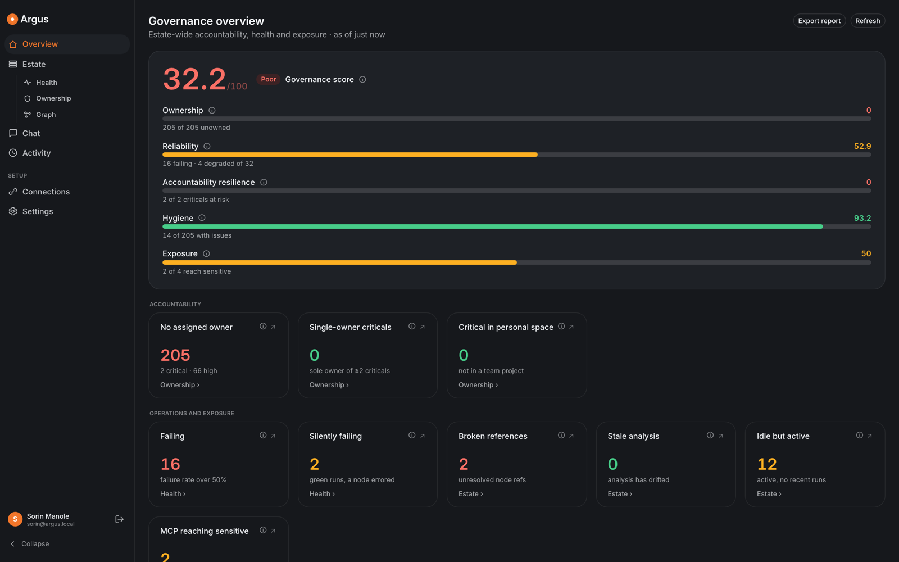
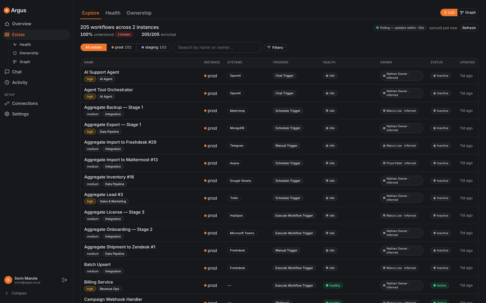
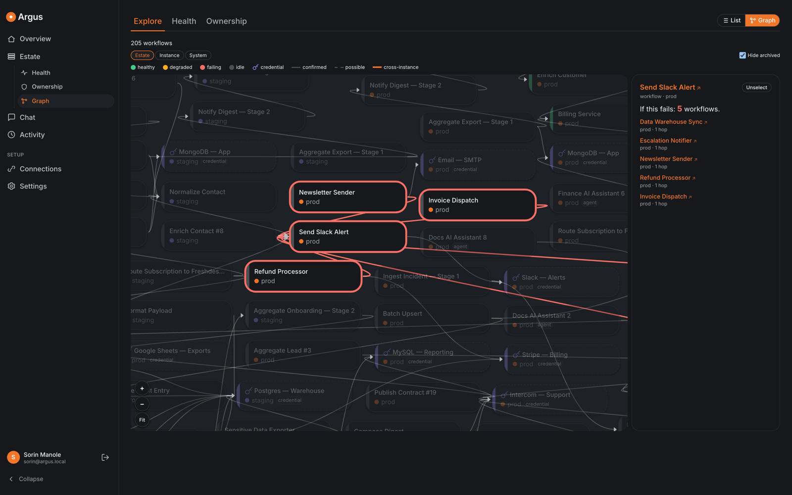
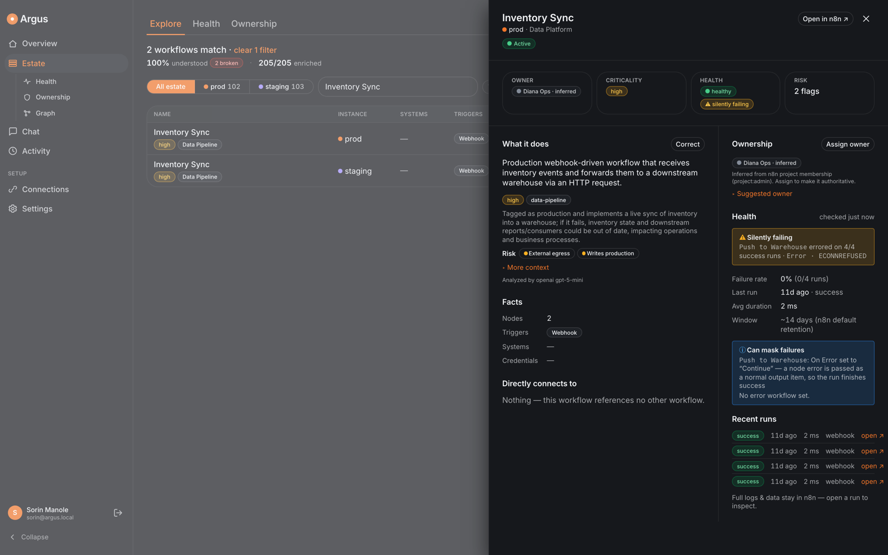

# Argus

**Fleet-wide governance and accountability for n8n.**

n8n is where teams build and run automations. Argus is the layer above it: it connects to
one or more n8n instances, reads the whole estate, and answers the questions a platform
owner has to answer — **what's running, who's accountable, and what breaks if this fails.**

Argus is **read-only** against your instances. It never creates, edits, activates, or
deletes a workflow. The only thing it writes is its own governance layer — owner
assignments, corrections, and an append-only audit trail — in its own database.



---

## What it does

| | |
|---|---|
| **Live inventory** | Every workflow across every connected instance in one list: project, instance, active/archived state, systems it touches, triggers, last update. Refreshed automatically. |
| **Health** | Per-workflow status (healthy / degraded / failing / idle / inactive) computed from execution history, plus **silent-failure detection** — runs marked *success* where a node actually errored and was swallowed. |
| **Ownership & accountability** | An answerable owner per workflow (n8n has no per-workflow owner concept). Assign owners and backups, see inferred owners as advisory hints, and surface governance gaps: unowned workflows, single-owner-critical people, personal-space criticals, missing backups. |
| **Dependency graph & blast radius** | A fleet-wide graph of how workflows relate — sub-workflow calls, agent tools, error workflows, shared credentials, webhook links — with edge-type-aware impact analysis: *"if this fails, exactly these N workflows break."* Includes **cross-instance** dependencies (a staging workflow calling a prod webhook). |
| **AI sense-making** *(optional)* | A plain-English summary, category, and criticality (with a reason) per workflow, from the LLM provider you choose — including a self-hosted one. |
| **MCP exposure** | Which workflows are published to n8n's MCP server as agent-callable tools, and what each one can reach (credentials, external systems, sub-workflows) — flagged when an exposed workflow reaches something sensitive. |
| **Governance overview** | One screen scoring the estate on ownership, reliability, accountability resilience, hygiene, and exposure, with every number drillable to the workflows behind it. Exportable. |
| **Chat** *(optional)* | Ask questions in natural language. Every number and name comes from a deterministic tool call — the model narrates, it never computes. |
| **Audit trail** | Every governance action (owner assigned, label corrected, connection added, report exported) is append-only logged with actor, before → after, and origin. |

**Deterministic by default.** Facts — dependencies, blast radius, health, counts, ownership
— are computed, auditable, and work with no AI configured at all. The LLM only adds
interpretation, clearly labelled. When something can't be parsed, Argus says **"couldn't
analyse"** rather than guessing.

---

## What it looks like

**One estate, however many instances.** Every workflow across every connected instance in
a single list — filterable by instance, system, trigger, health and owner.



**Blast radius.** Select anything and see exactly what breaks if it fails — including
**cross-instance** dependencies, like a staging workflow calling into prod.



**Failures n8n reports as successes.** A run marked *success* where a node errored and the
error was swallowed. Here the failure rate reads 0% over four green runs, while the node
`Push to Warehouse` had been failing with `ECONNREFUSED` the whole time.



---

## How it works

Argus polls each connected instance's **Public API** on an interval (default 30s),
reconciles the results into a local SQLite cache, and recomputes facts, edges, health, and
governance scores. Everything derived is rebuildable from scratch; ownership assignments
and the audit log live in separate tables that are never touched by a resync.

```
n8n instance(s) ──Public API (read-only key)──▶ Argus ──▶ SQLite cache + governance tables
                                                  │
                                    analyzer · health · ownership · graph
                                                  │
                                        Express API + web UI
```

---

## Requirements

- **Node >= 22.22** and **pnpm >= 10**
- One or more **n8n instances** you can reach over HTTP. Tested against **n8n 2.29.0**.
- A **read-only n8n API key** for each instance (created in n8n under *Settings → n8n API*).
- Some surfaces are enterprise-licensed in n8n itself (projects and users). Without them
  Argus still works — the affected features degrade explicitly rather than failing.

---

## Install

```bash
git clone https://github.com/somanole/project-argus.git
cd project-argus
pnpm install
pnpm build
```

If the native dependencies (`better-sqlite3`, `esbuild`) didn't build, run
`pnpm rebuild -r better-sqlite3 esbuild`.

---

## Run

Set the secrets, then start the server. It serves the API **and** the web UI from a single
origin, so there is nothing else to deploy.

```bash
export ARGUS_ADMIN_PASSWORD='<a strong password>'
export ARGUS_SESSION_SECRET="$(openssl rand -hex 32)"
export ARGUS_ENCRYPTION_KEY="$(openssl rand -hex 32)"
export ARGUS_DB_PATH=/var/lib/argus/argus.sqlite
export ARGUS_SERVE_WEB=true   # serve the built UI from the same port

node apps/server/dist/index.js
```

Open **http://127.0.0.1:3000** and sign in with the admin password plus your name and
email. Those identify you on the audit trail.

That single port serves both the UI and the API, because `ARGUS_SERVE_WEB=true` tells the
server to serve the built web app alongside it — there is no separate frontend process in
production. (Port `5173` is the Vite dev server, used only during development.)

> `ARGUS_ENCRYPTION_KEY` encrypts every stored n8n API key. **Back it up and don't rotate
> it casually** — losing it means re-registering every connection. `ARGUS_DB_PATH` holds
> your ownership records and audit log; back that up too.

By default the server binds to `127.0.0.1:3000`. Put it behind a reverse proxy with TLS,
or set `ARGUS_HOST`/`ARGUS_PORT` to suit your environment.

---

## Connect your n8n instances

1. In each n8n instance, create an API key under **Settings → n8n API**. Read/list scopes
   only — Argus never needs write access.
2. In Argus, open **Connections → Add connection** and provide:
   - a **label** (e.g. `prod`, `staging`),
   - the instance **base URL**,
   - the **API key**,
   - optionally the instance's **public webhook host**, which lets Argus confirm
     cross-instance webhook dependencies instead of reporting them as *possible*.

Argus validates the key against the live instance before saving anything, and tells you
plainly whether a failure was *unreachable* or *unauthorized*.

**Scopes and what they unlock**

| Scope | Enables |
|---|---|
| `workflow:list`, `project:list` | The catalog, analyzer facts, and the dependency graph |
| `execution:list` (+ `execution:read`) | Health, failure rates, and silent-failure detection |
| `user:list` | Advisory inferred owners (explicit assignment works regardless) |

Missing a scope never breaks Argus — the dependent feature reports itself as unavailable
with the reason.

---

## AI features (optional)

Enrichment (summaries, categories, criticality) and chat are the only features that use an
LLM. Everything else is deterministic. Choose a provider in **Settings**:

| Provider | You supply | Model |
|---|---|---|
| **OpenAI** | API key | `gpt-5-mini` |
| **Anthropic** | API key | `claude-haiku-4-5` |
| **OpenAI-compatible endpoint** | Base URL + model id, API key optional | yours |

**Nothing has to leave your network.** The third option is any OpenAI-compatible API —
vLLM, TGI, Ollama, LM Studio, or a corporate gateway. Point Argus at one inside your
network and no workflow names, owner names, or governance metadata reach a third party.

```bash
# fully local inference
ollama serve && ollama pull llama3.1:8b
# then Settings → Custom endpoint:
#   Base URL  http://127.0.0.1:11434/v1
#   Model     llama3.1:8b
#   API key   (leave blank)
```

Two things Argus enforces rather than assumes:

- **Chat needs a model that can call tools.** Argus capability-probes the endpoint when you
  save it; if the model can't emit tool calls, chat reports *"chat unavailable on this
  provider"* and enrichment carries on. Argus never answers a governance question from a
  guess.
- **Data minimisation is identical across providers.** Input is a strict allowlist (no raw
  URLs or hostnames), passed through a redaction pass before any call. Set
  `ENRICHMENT_ENABLED=false` to disable LLM use entirely and keep a fully functional
  deterministic Argus.

Exactly what is sent is documented in [`docs/DATA-FLOW.md`](docs/DATA-FLOW.md) and
[`docs/DATA-FLOW-CHAT.md`](docs/DATA-FLOW-CHAT.md).

---

## Security

- **Read-only against n8n.** Argus only ever reads your instances.
- **Everything is behind a login.** Every API route requires a session, apart from the
  health check and the login endpoint itself.
- **API keys are encrypted at rest** (AES-256-GCM) and are never returned by any API,
  written to logs, or recorded in the audit trail.
- **Argus audits itself.** Every mutation writes an append-only audit entry in the same
  transaction as the change. The audit table rejects updates and deletes at the database
  level.
- **Run it on a private network.** Argus is designed for an internal deployment behind
  your own TLS/reverse proxy, not for public exposure. A compromised Argus means read
  access to every connected instance, so treat it as a high-value host.
- **Scope, stated plainly.** Argus is a **platform-owner tool**: anyone who can sign in
  sees the whole estate. It does not reproduce n8n's per-project RBAC. Give access only to
  the people who should see every instance.
- **Identity is asserted.** The name and email you enter at login are stamped on your
  session and every audit entry, and displayed as *asserted* — they are not verified
  against an identity provider.
- **Sharing an instance?** Set `ARGUS_DEMO_MODE=true`. It does two things, both enforced
  on the server so the API cannot leak or be driven around them:
  - **Read-only.** Every mutating request is refused, so a visitor cannot delete a
    connection, reassign owners, rewrite the LLM settings, or trigger a re-enrichment
    run that spends your API credits. Signing in, browsing and chat still work.
  - **Actor identities masked.** The audit trail records whoever signed in, so on a
    shared instance one visitor's name and email would otherwise be visible to the
    next. They are masked in the timeline, its CSV export and the overview changelog,
    and filtering by actor is disabled. The log itself still records the real actor.

  Chat remains available because its tools only read — but each message spends LLM
  credits. Set `ENRICHMENT_ENABLED=false` to switch all LLM features off.

  For a demo anyone should be able to open, also set `ARGUS_DEMO_PASSWORD`; it is
  pre-filled on the login form. It is a separate variable on purpose — turning on demo
  mode must never publish an instance's real `ARGUS_ADMIN_PASSWORD` as a side effect.

---

## Configuration

| Variable | Default | Purpose |
|---|---|---|
| `ARGUS_ADMIN_PASSWORD` | `argus` *(dev only)* | Login password. **Set this.** |
| `ARGUS_SESSION_SECRET` | dev value | Signing key for the session cookie. **Set this.** |
| `ARGUS_ENCRYPTION_KEY` | dev value | Encrypts stored n8n API keys. **Set and back up.** |
| `ARGUS_DB_PATH` | `data/argus.sqlite` | Database holding connections, ownership, audit log. |
| `ARGUS_HOST` / `ARGUS_PORT` | `127.0.0.1` / `3000` | Listen address. |
| `ARGUS_POLL_INTERVAL_MS` | `30000` | How often each connection is re-listed and reconciled. |
| `ARGUS_SERVE_WEB` | `false` | Serve the built web UI from the same port. Set `true` for a single-origin deployment. |
| `ARGUS_WEB_DIST` | `apps/web/dist` | Location of the built UI (used when `ARGUS_SERVE_WEB=true`). |
| `ENRICHMENT_ENABLED` | `true` | Set `false` to disable all LLM calls. |
| `ARGUS_ENRICHMENT_CONCURRENCY` | `3` | Concurrent enrichment calls. |
| `ARGUS_ENRICHMENT_SPEND_CAP_TOKENS` | `5000000` | Per-run token budget (`0` = unlimited). |
| `ARGUS_CHAT_EGRESS_EMAILS` | `false` | Allow chat tool results to include owner emails. Off by default. |
| `ARGUS_DEMO_MODE` | `false` | For a shared/public demo. Makes the instance **read-only** (every mutating request is refused) and masks actor names/emails in the audit timeline, its CSV export and the overview changelog. The database still records the real actor. |
| `ARGUS_DEMO_PASSWORD` | unset | Only read when `ARGUS_DEMO_MODE=true`. Pre-fills this password on the login form so visitors can sign in to a public demo. Deliberately separate from `ARGUS_ADMIN_PASSWORD`, which is never published. |

Unset secrets fall back to insecure development defaults and log a warning — never
silently.

---

## Development

```bash
pnpm dev         # UI on http://localhost:5173, API on :3000
pnpm typecheck   # TypeScript, strict
pnpm lint        # ESLint over TS + Vue
pnpm test        # Vitest across all packages
pnpm build       # build shared → server → web
```

In development the two run separately: Vite serves the UI on **5173** with hot reload and
proxies `/api` to the Express server on **3000**, so you don't set `ARGUS_SERVE_WEB`. In
production the server serves both from **3000**, as above.

The UI is built on Argus's own design tokens, supports light and dark themes, and is
responsive from 375px up.

---

## License

Argus is released under the [MIT License](LICENSE).

The only bundled third-party material is the Inter and Commit Mono font families, both
under the SIL Open Font License 1.1. See
[`THIRD-PARTY-NOTICES.md`](THIRD-PARTY-NOTICES.md) before redistributing.

Argus is an independent project and is not affiliated with or endorsed by n8n GmbH.
